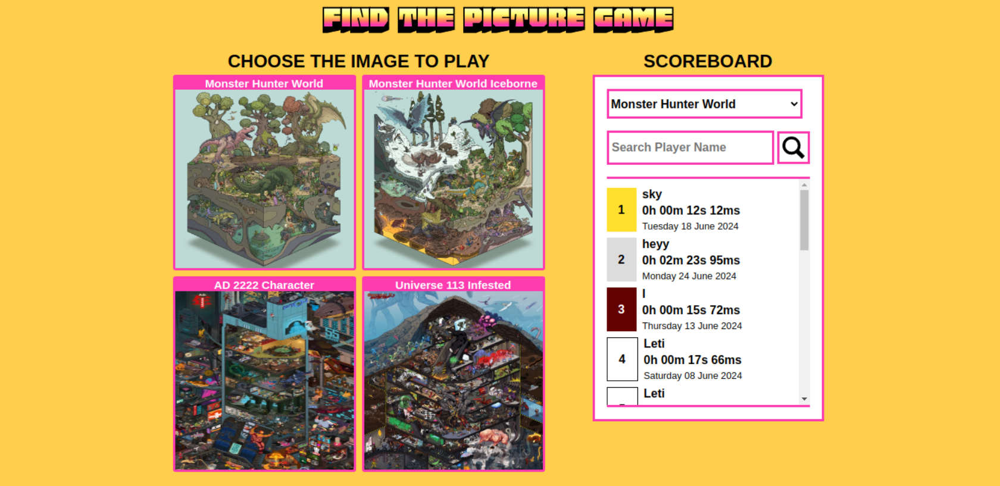

# photo-tagging-game

Photo-tagging game created to put into practice what I learned during <a href="https://www.theodinproject.com/" target="_blank">The Odin Project course</a>

<a href="https://fluffy-empanada-a2d6c3.netlify.app/" target="_blank">Link to the app website</a>

<h2>Technology used:</h2>

<ul>
    <li>HTML</li>
    <li>CSS</li>
    <li>JavaScript</li>
    <li>React</li>
    <li>Node.js</li>
    <li>Express</li>
    <li>MongoDB</li>
    <li>Mongoose</li>
</ul>

<h2>Cloud hosting platforms</h2>

<ul>
    <li>Frontend <a href="https://www.netlify.com/" target="_blank">Netlify</a></li>
    <li>Backend <a href="https://fly.io/" target="_blank">Fly.io</a></li>
</ul>

<h2>Credit:</h2>

<h3>Fonts</H3>

<ul>
  <li><a href="https://fonts.google.com/specimen/Honk?preview.text=FIND%20THE%20PICTURE%20GAME&coloronly=true&sort=popularity&subset=latin&noto.script=Latn" target="_blank" >Honk</a></li>
</ul>

<h3>SVG</H3>
<ul>
  <li><a href="https://www.svgrepo.com/svg/366631/cancel" target="_blank" >Cancel</a></li>
  <li><a href="https://www.svgrepo.com/svg/513607/search" target="_blank" >Search</a></li>
  <li><a href="https://www.svgrepo.com/svg/397713/party-popper" target="_blank" >Party popper</a></li>
</ul>

<h3>Images used</H3>
<ul>
  <li><a href="https://www.pixiv.net/en/artworks/77323388" target="_blank" >Monster hunter world</a></li>
  <li><a href="https://www.pixiv.net/en/artworks/80735589" target="_blank" >Monster hunter world iceborne</a></li>
  <li><a href="https://www.artstation.com/artwork/Z5VrOm" target="_blank" >A.D. 2222 character</a></li>
  <li><a href="https://www.artstation.com/artwork/49Znyq" target="_blank" >Universe 113 infested</a></li>
</ul>
